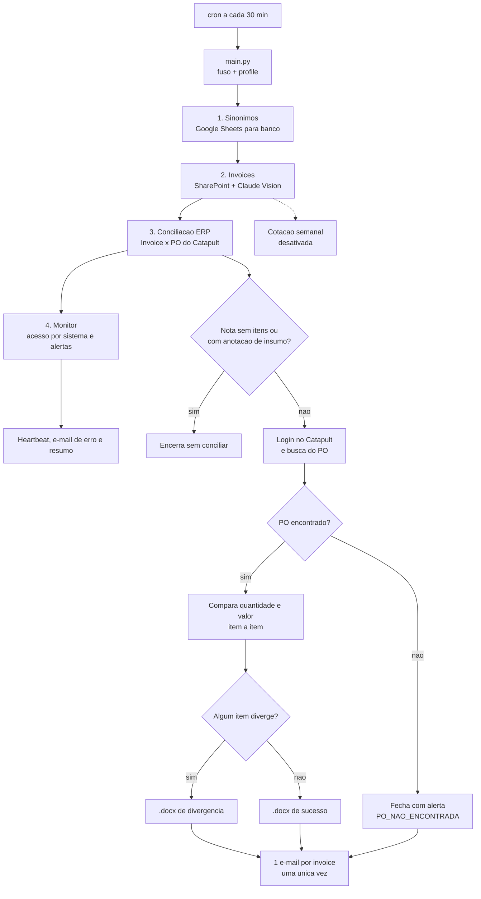

# RPA Schiavon

> Pipeline que baixa invoices de fornecedores do SharePoint, lê os dados com o
> Claude Vision e concilia cada nota contra o pedido (PO) lançado no ERP
> Catapult. Persiste em PostgreSQL (Azure) e avisa por e-mail.

## Índice

1. [Visão Geral](#1-visão-geral)
2. [Dados da Automação](#2-dados-da-automação)
3. [Pré-requisitos](#3-pré-requisitos)
4. [Configuração](#4-configuração)
5. [Fluxograma Macro](#5-fluxograma-macro)
6. [Regras de Negócio](#6-regras-de-negócio)
7. [Execução](#7-execução)
8. [Sustentação](#8-sustentação)
9. [Status de Execução](#9-status-de-execução)
10. [Estrutura do Projeto](#10-estrutura-do-projeto)
11. [O que NÃO funciona](#11-o-que-não-funciona)

---

## 1. Visão Geral

Uma execução de `python main.py` faz **uma passada** e termina, nesta ordem
(`crawler/controller.py`):

| # | Fluxo | O que faz |
|---|---|---|
| 1 | Sinônimos | Planilha De-Para (Google Sheets) → `dim_item_sinonimo` |
| 2 | Invoices | SharePoint → Claude Vision → `fat_invoice` / `fat_invoice_item` |
| — | ~~Cotação~~ | **Desativado por enquanto** (comentado no controller) |
| 3 | Conciliação ERP | Invoice × PO do Catapult → `fat_conciliacao`, relatórios `.docx`, e-mail ao cliente |
| 4 | Monitor | Consolida acesso por sistema e abre/fecha alertas à operação |
| — | ~~Painel~~ | **Desativado**: `painel_operacao.xlsx` não é mais gerado (comentado no controller) |

Cada fluxo roda isolado: se um falha, os outros seguem. O resumo no fim lista
OK/ERRO e o processo sai com código 1 se algo falhou.

## 2. Dados da Automação

| Campo | Valor |
|---|---|
| Nome do Robô | RPA Schiavon |
| Empresa | DataGuvi |
| Cliente | Schiavon |
| Entrada em produção | _(a definir)_ |
| Periodicidade | cron a cada 30 min, com `flock` (sem execução dupla) |
| Fuso | `America/Sao_Paulo`, fixado pelo robô (o servidor roda em UTC) |

Schema `dwschiavon2`: `processo` (controle do caso), `fat_invoice` /
`fat_invoice_item`, `fat_conciliacao` / `_item`, `dim_fornecedor` /
`dim_fornecedor_alias`, `dim_item_sinonimo`, `dim_item_catapult`, `dim_sistema`,
`alerta`, `agendamento`, e as tabelas de cotação. O nome do schema vem de
`domain/service/processo_service.py::SCHEMA`.

## 3. Pré-requisitos

- Python 3.12+ e PostgreSQL acessível (`sslmode=require`).
- Playwright com Chromium (`playwright install chromium`) para SharePoint e Catapult.
- `pip install -r requirements.txt`.
- Rede liberada para SharePoint, API Anthropic, Google APIs, SMTP (porta 465),
  Twilio e Catapult/ECRS (atrás de Cloudflare Access).
- Caixa Gmail autorizada por OAuth (`python -m manutencao.gmail_oauth_setup`,
  feito uma vez, numa máquina com navegador) para ler o OTP do Cloudflare Access.
- Linux: pacote `tzdata`.

## 4. Configuração

Segredo **não vai versionado**: fica em `resources/config-dev.env` ou
`resources/config-prod.env` (ambos no `.gitignore`). O profile ativo sai de
`RPA_ENV` (`dev` | `prod`, default `prod`). Copie `resources/config.example.env`,
que lista todas as chaves sem valor. A leitura é tipada em `domain/config.py`.
Só as 5 chaves do banco são obrigatórias para iniciar; credencial de sistema
externo ausente faz só aquele fluxo pular com aviso.

Arquivos de credencial, também fora do git: `resources/google/service_account.json`
(Sheets) e `resources/gmail/{client_secret,token}.json` (OTP).

## 5. Fluxograma Macro



## 6. Regras de Negócio

**Seleção das notas**
- Semana operacional: segunda a domingo.
- Só entra a nota ainda não conciliada. Nota finalizada não volta por cair na
  janela de data.
- Por loja, não se avança para a semana nova sem fechar a anterior: nota ainda
  não tentada prende a loja. Nota em erro técnico (50–59) é retentada, mas não
  prende.
- Nota marcada para reprocesso (status 56) entra sempre, mesmo fora da janela.
- Nota sem itens de mercadoria encerra sem conciliar. Nota com anotação à mão
  de "insumo" não vai ao Catapult.

**Conciliação contra o PO**
- O PO é buscado pela Invoice Reference (`Contains`, nunca `Begins with`).
  Havendo vários, vale o de maior fração de itens casados com a nota.
- O item da invoice casa com o do PO por código; se falhar, por nome
  aproximado; senão fica sem par.
- Compara quantidade (invoice × Ordered × Received) e valor (× Invoiced Total
  Cost), dentro de tolerância. Linhas da invoice que caem no mesmo item do PO
  são somadas.
- Sem PO encontrado: a nota fecha com alerta (`PO_NAO_ENCONTRADA`).

**Relatórios e e-mail**
- Cada nota gera **um** `.docx`: divergência se algum item diverge, sucesso se
  tudo bate. Os dois são mutuamente exclusivos.
- **Um e-mail por invoice, uma única vez**, ao fim da Conciliação ERP, para
  `DESTINATARIOS_CLIENTE` (`domain/config.py`). Nota que já tinha conciliação
  gravada regera o `.docx`, mas não reenvia e-mail. `bpo@rokkasmarket.com`
  está comentado até validar o envio.
- Anexo acima de 18 MB vai sem anexo (limite de 25 MB do Outlook) e registra erro.
- Falhas viram **um** e-mail consolidado por execução, com traceback, para
  `ALERTA_EMAIL` (default `dataguvi@gmail.com`).

**Falhas e reprocesso**
- Falha esperada de negócio (`BusinessException`) não derruba o monitoramento;
  falha técnica sim. Status nunca é escolhido à mão: sai de `domain/enums.py`.
- Sinônimo ou alias novo que pode destravar notas já finalizadas as devolve à
  fila (limite de 200 por vez, acima disso exige rodada manual).
- Monitor: abre alerta para sistema crítico com acesso falho ou fluxo parado há
  mais de 12 h; não repete e resolve sozinho quando a causa some.

## 7. Execução

| Comando | O que faz |
|---|---|
| `python main.py` | Roda os fluxos ativos, em ordem. Sem flags. |
| `python -m pytest` | Testes, em memória, sem Postgres. Devem passar. |
| `python -m manutencao.teste_servidor [--email] [--login]` | Smoke test do servidor (banco, Chromium, Claude, Sheets, Gmail, SMTP); somente leitura |
| `python -m manutencao.sharepoint_loja [--loja N] [--janela]` | Lista as pastas das 2 semanas da loja (default 2, Dr. Phillips); `--janela` abre o navegador logado. Somente leitura |
| `python -m manutencao.teste_conciliacao_erp` | Teste manual da conciliação ERP (não grava) |
| `python -m manutencao.<nome>` | Scripts de manutenção: simulam por padrão, gravam só com `--aplicar` |

Crontab de produção:

```cron
SHELL=/bin/bash
RPA_ENV=prod
*/30 * * * * flock -n /tmp/rpa-schiavon.lock -c 'cd /home/rpa/schiavon && .venv/bin/python main.py >> logs/rpa_$(date +\%F).log 2>&1'
```

## 8. Sustentação

- **Log:** stdout, redirecionado pelo cron para `logs/rpa_<data>.log`.
- **Monitoramento:** o fluxo Monitor carimba `dim_sistema` e abre `alerta`.
  Login em cada sistema chama `sistema_service.registrar_acesso`.
- **Erros:** todo ponto de falha chama `notificacao_service.registrar_erro`; o
  controller envia o consolidado no `finally`, mesmo que o controller caia.
- **Catapult / Cloudflare Access:** cada login novo pede OTP por e-mail, lido
  de `CLOUDFLARE_ACCESS_EMAIL`. Erro *"That account does not have access"* é
  política do Cloudflare, não do código.
- **Reprocesso:** casos com `cod_status` 50–59 caem sozinhos na fila.
- **Cadastrar fornecedor no Catapult** (`dim_fornecedor_alias`, único lugar de
  cadastro). O nome do fornecedor no Catapult é o texto do `Name` do PO antes
  do primeiro `-` (`Perdomo-036998-HQ-RS2` -> `Perdomo`). Basta **uma linha**
  `origem='erp'` apontando para o fornecedor:

  ```sql
  INSERT INTO dwschiavon2.dim_fornecedor_alias (id_fornecedor, alias, alias_norm, origem)
  VALUES (42, 'Perdomo', 'PERDOMO', 'erp');
  ```

  `alias_norm` = nome em maiúsculas, sem pontuação nem sufixo societário
  (INC, LLC...), igual a `norm_supplier`. O robô acha o fornecedor pelo nome
  lido da invoice (fuzzy ≥ 90 contra `dim_fornecedor.nome`) e busca no Catapult
  pelo alias `erp` dele; sem cadastro, busca pelo nome cru. Linha
  `origem='invoice'` só é necessária quando o nome lido na nota é muito
  diferente do nome do fornecedor (aponta para o mesmo `id_fornecedor`; carne
  também depende dela). O robô também **grava/atualiza o alias `erp` sozinho**
  quando um PO do Catapult casa a ≥ 95% com o nome da invoice e o fornecedor
  resolvido também casa a ≥ 95%. Conferir:
  `SELECT * FROM dwschiavon2.dim_fornecedor_alias WHERE origem='erp' AND id_fornecedor=42;`

## 9. Status de Execução

Gravado em `processo.cod_status` (fonte: `domain/enums.py`). Faixas: `0–9`
terminou · `10–19` em curso · `20–29` encerrado sem completar · `50–59` erro
técnico (reprocessável).

| Código | Status | Descrição |
|---|---|---|
| 0 | `FINALIZADO` | Todas as etapas concluídas |
| 1 | `FINALIZADO_COM_ALERTA` | Concluído, há item para conferir |
| 10 | `PENDENTE` | Criado, nenhuma etapa rodou |
| 11 | `EM_ANDAMENTO` | Alguma etapa concluída, faltam outras |
| 12 | `AGUARDANDO_RESPOSTA` | Parado à espera do fornecedor |
| 21 | `ENCERRADO_SEM_ARQUIVO` | Pasta da semana existe, mas vazia |
| 50 | `ERRO_LOGIN` | Falha de autenticação na origem |
| 51 | `ERRO_NAVEGACAO` | Pasta/arquivo não encontrado na origem |
| 52 | `ERRO_LEITURA` | A IA não conseguiu extrair o documento |
| 53 | `ERRO_API` | Falha de rede ou de serviço externo |
| 54 | `ERRO_BAIXA_CONFIANCA` | Leitura abaixo do piso de confiança |
| 55 | `ERRO_SEM_FORNECEDOR` | Nome da nota não casou com nenhum alias |
| 56 | `REPROCESSAR_CONCILIACAO` | Marcado para reconciliar após correção de de-para |

```
PENDENTE -> COLETAR -> LER -> IDENTIFICAR_FORNECEDOR -> CONCILIAR_ERP -> FINALIZADO
COLETAR -> ERRO_LOGIN | ERRO_NAVEGACAO     LER -> ERRO_LEITURA | ERRO_API | ERRO_BAIXA_CONFIANCA
IDENTIFICAR -> ERRO_SEM_FORNECEDOR
```

O veredito de uma comparação é outro vocabulário (`StatusConciliacao`, em
`fat_conciliacao(_item).cod_status`): `0` CONFERIDO · `12` DIVERGENCIA ·
`20` SEM_REFERENCIA_ITEM · `21` UNIDADE_DIVERGENTE.

## 10. Estrutura do Projeto

`commons` é ferramenta (sem regra de negócio), `domain` é o dado e a regra,
`crawler` é o robô. Setas nunca ao contrário: `commons` não importa `domain`
nem `crawler`; `domain` não importa `crawler`; nenhum fluxo importa outro fluxo.

```
main.py              # entrypoint fino
crawler/             # controller, pipeline, flow/ (um por fluxo), reports/
commons/             # db, paths, exception, logging, datas, email_client,
                     # matcher, sharepoint/, catapult/, vision/, gmail/, sheets/
domain/              # config, enums, model/, service/ (todo SQL fica aqui)
coleta_invoices/     # fluxo 2
conciliacao/         # regra de uma invoice (reconcile_erp, relatórios .docx)
cotacao/             # ciclo semanal de carnes (desativado)
manutencao/          # scripts avulsos, fora do pipeline
tests/               # em memória, sem Postgres
resources/           # config.example.env (profiles reais ficam fora do git)
files/               # dados de execução (fora do git)
```

## 11. O que NÃO funciona

Testado e descartado, não tentar de novo sem mudar a premissa:

- **MSAL device flow / ROPC**: app público não autorizado no tenant.
- **`requests` com basic auth**: o SharePoint moderno não aceita.
- **`client.messages.parse()`**: estoura com schemas complexos. Usar
  `messages.create()` + `json.loads`.
- **`thinking` adaptativo com structured outputs**: causa timeout.
- **Buscar PO no Catapult com `Begins with`**: abre o PO errado em silêncio.
  Usar `Contains`.
- **Ler a grade Items do PO logo que o container aparece**: a grade carrega em
  duas fases. Esperar uma linha (`tr`) real.
